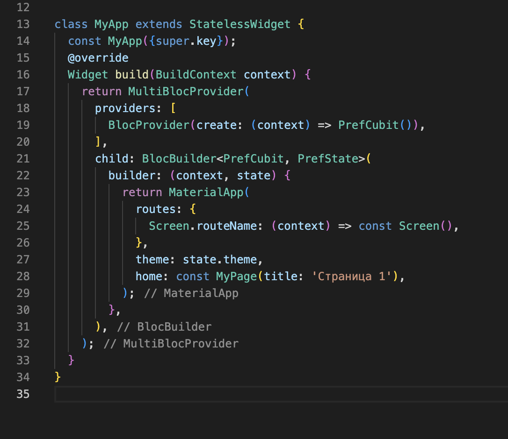
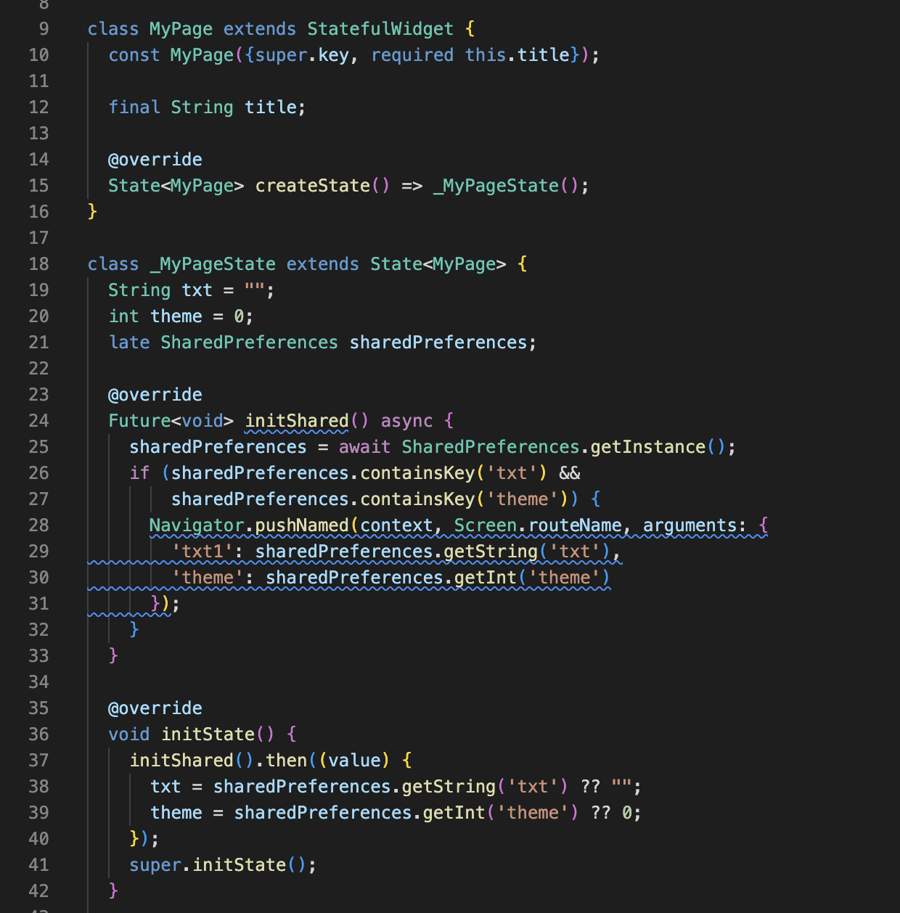

# ПРАКТИЧЕСКАЯ РАБОТА №5

## SharedPrefrences.

Цель работы: реализовать передачу данных через параметр arguments и сохранение данных в SharedPrefrences, реализовать восстановление данных после закрытия приложения. Если есть данные в SharedPrefrences открыть 2 экран, если данных нет, то открыть 1 экран. Так же реализовать восстановление темы приложения.

Для начала в pabspec.yaml необходимо добавить shared_preferences: ^2.0.15

В файле main.dart необходимо указать переходы между страницами и передачу темы через cubit.
 

Рисунок 1 - main.dart

Далее необходимо создать Cubit файлы для перерисовки экрана и изменения темы.
 

Рисунок 2 - pref_cubit.dart
 

Рисунок 3 - pref_state.dart

После необходимо в файле page.dart прописать строки для дальнейшего хранения значений под определенными ключами с помощью SharedPreference.

 
Рисунок 4 - page.dart SharedPreference

Далее в том же файле необходимо при нажатии на кнопку прописать сохранение данных под определенными ключами.
 

Рисунок 5 - page.dart сохранение данных

Затем в файле screen.dart, отвечающим за второй экран, необходимо получить сохраненные данные по ключу.

 
Рисунок 6 - screen.dart получение данных

Результат работы:

 
Рисунок 7 - Результат работы (1)

 
Рисунок 8 - Результат работы (2)

Далее напишем clovo и включим темную тему, перейдем на второй экран и закроем приложение. После повторного открытия сразу открывается второй экран со всеми теми же данными.
 

Рисунок 9 - Результат сохранения данных после перезапуска приложения

Вывод: в ходе выполнения данной практической работы удалось реализовать передачу данных через параметр arguments и сохранение данных в SharedPrefrences, реализовать восстановление данных после закрытия приложения. Если есть данные в SharedPrefrences открыть 2 экран, если данных нет, то открыть 1 экран. Так же реализовать восстановление темы приложения.

